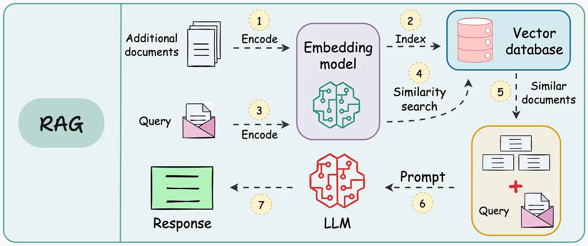

# AiTutor

AiTutor is a web application that allows users to upload PDFs and chat with their documents using AI. The application processes PDF documents, splits them into chunks, and uses vector embeddings to retrieve relevant content when answering user questions.

## Features

- 📄 PDF document upload and viewing
- 💬 AI-powered chat interface for document Q&A
- 🔍 Vector search for semantic retrieval of document content
- 🔄 Conversation history and management
- 🔐 User authentication system
- ⚙️ OpenAI API key integration


*Image credit: https://www.dailydoseofds.com/*

## Tech Stack

- **Frontend**: Next.js, React, TailwindCSS
- **Backend**: Next.js API routes
- **Database**: PostgreSQL with pgvector extension
- **AI Integration**: OpenAI GPT-4 API, LangChain
- **Authentication**: Custom session-based auth
- **Storage**: Vercel Blob Storage for PDFs

## Prerequisites

- Node.js v18+
- Docker and Docker Compose
- OpenAI API key
- Vercel Blob Storage account or another blob storage solution (optional for production)

## Installation

### 1. Clone the repository

```bash
git clone https://github.com/CruiseDevice/ai-tutor
cd ai-tutor
```

### 2. Install dependencies

```bash
npm install
```

Start the PostgreSQL container:

```bash
docker-compose up -d
```

### 3. Set up environment variables

Create a `.env` file in the root of your project:

```env
# Environment variables declared in this file are automatically made available to Prisma.
# See the documentation for more detail: https://pris.ly/d/prisma-schema#accessing-environment-variables-from-the-schema

# Prisma supports the native connection string format for PostgreSQL, MySQL, SQLite, SQL Server, MongoDB and CockroachDB.
# See the documentation for all the connection string options: https://pris.ly/d/connection-strings

DATABASE_URL=""
NODE_ENV=""
BLOB_READ_WRITE_TOKEN=""
```

### 4. Set up Prisma

Generate Prisma client:

```bash
npx prisma generate
```

Create database tables:

```bash
npx prisma db push
```

## Running the application

Start the development server:

```bash
npm run dev
```

The application should now be running at [http://localhost:3000](http://localhost:3000).

## User Setup

1. Register a new account at `/register`
2. Navigate to API Settings and add your OpenAI API key
3. Return to the dashboard to upload and chat with PDFs

## Project Structure

- `/app`: Next.js application routes and components
  - `/api`: Backend API routes
  - `/components`: React components
  - `/auth`: Authentication related files
- `/lib`: Utility libraries 
  - `/auth.ts`: Authentication utility functions
  - `/db.ts`: Database client setup
  - `/pgvector.ts`: Vector database utilities

## API Routes

- **Authentication**
  - `/api/auth/register`: User registration
  - `/api/auth/login`: User login
  - `/api/auth/logout`: User logout
  - `/api/auth/verify-session`: Verify user session
  - `/api/auth/user`: Get current user information

- **Document Management**
  - `/api/documents`: Upload and create new documents
  - `/api/documents/process`: Process and index uploaded documents

- **Conversation Management**
  - `/api/conversations`: List all conversations
  - `/api/conversations/[id]`: Get a specific conversation

- **Chat**
  - `/api/chat`: Send a message and get AI responses

## Workflow

1. **Document Upload**: User uploads a PDF through the interface
2. **Document Processing**: 
   - PDF is stored in Blob Storage
   - Document is split into chunks
   - Each chunk gets a vector embedding using OpenAI's embedding model
   - Chunks and embeddings are stored in PostgreSQL
3. **Chatting with Document**:
   - User sends a question
   - System finds relevant chunks using vector similarity search
   - OpenAI's GPT model generates a response using the relevant document chunks

## Contributing

1. Fork the repository
2. Create a feature branch (`git checkout -b feature/amazing-feature`)
3. Commit your changes (`git commit -m 'Add some amazing feature'`)
4. Push to the branch (`git push origin feature/amazing-feature`)
5. Open a Pull Request

## License

This project is licensed under the MIT License.

## Troubleshooting

### PostgreSQL Connection Issues

If you're having trouble connecting to the PostgreSQL database:

1. Check that the Docker container is running: `docker ps`
2. Verify the connection string in your `.env` file
3. Try connecting using a PostgreSQL client like pgAdmin or psql

### OpenAI API Issues

If the AI chat is not working properly:

1. Check that you've added your OpenAI API key in the application settings
2. Verify that your API key has sufficient credits
3. Check the application logs for any API-related errors

### PDF Processing Issues

If PDFs aren't being processed correctly:

1. Check that the PDF is not password-protected
2. Verify that the PDF size is under the upload limit (10MB)
3. Check the application logs for processing errors